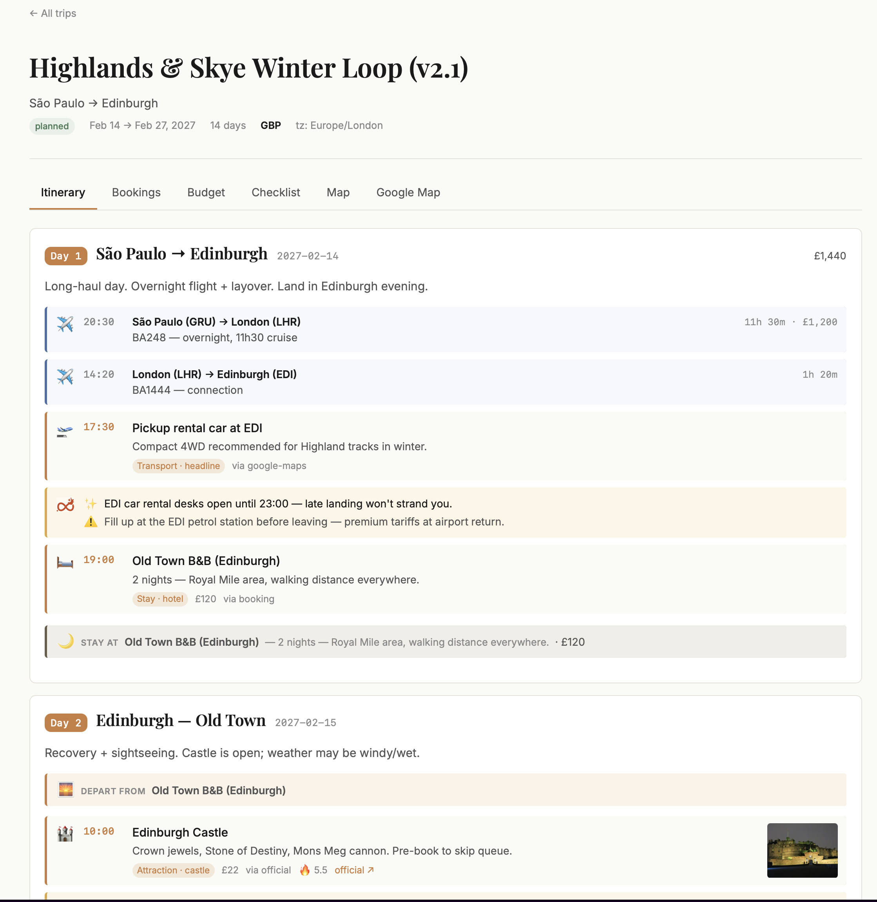
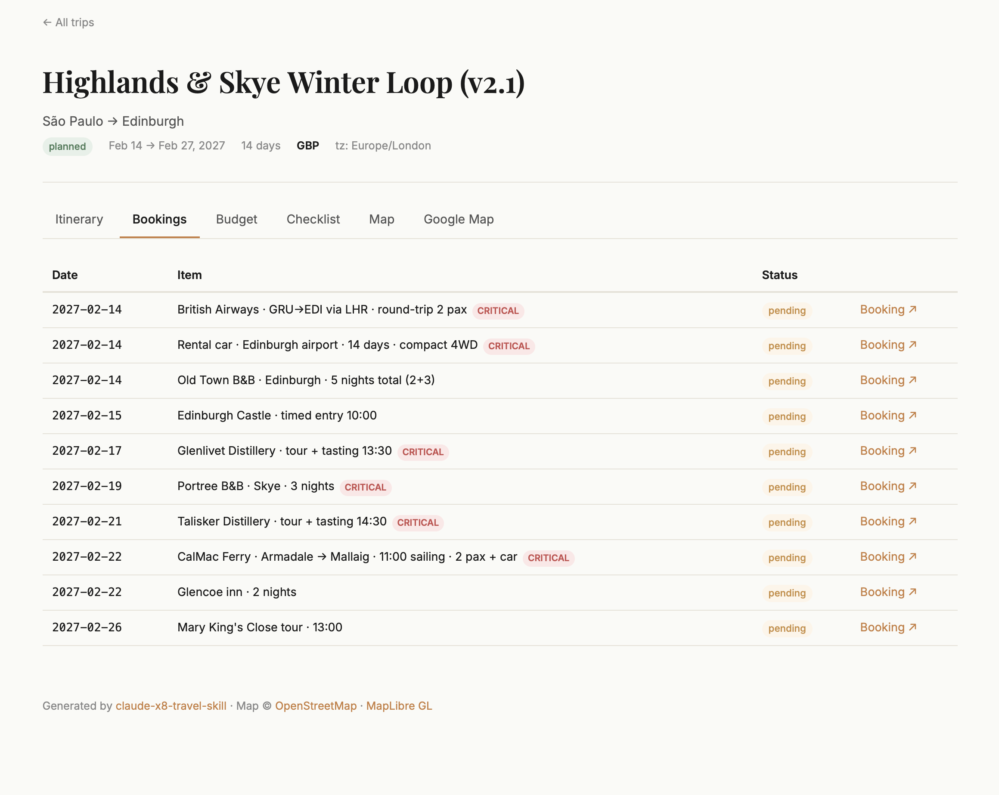

# claude-x8-travel-skill

> A Claude Code skill (and CLI) for planning multi-day, multi-stop trips. Output is a single structured `trip.json` (schema v3) you can view in a local static viewer (no API key) or publish to [explor8.ai](https://explor8.ai) for a richer during-trip experience.

## What this is

A planning workflow for trips that don't fit a one-shot itinerary generator: long-form (1–4 weeks), multi-stop, with rooms for trekking, motorhome, off-grid, and city legs.

Three pieces:

- **A Claude Code skill** (`/travel-planner`) — wizard + 7 modes. The skill drives Claude to do the LLM-driven parts (research, weather, budget, map editing).
- **A CLI** (`x8-travel`) — handles deterministic-code parts: schema validation, publishing.
- **A local static viewer** (`viewer/index.html` + `viewer/trip.html?slug=...`) — MapLibre + OpenStreetMap (no API key), plus an optional Google Map tab. Open in any browser.

Plans live in `trips/<slug>/` (gitignored — personal data) as a single v3 document:

```
trips/
  user-preferences.md          # shared across all your trips
  scotland-2027/
    trip-params.md             # this trip's wizard answers
    trip.json                  # canonical v3 document — places + routes + days
```

**Schema v3 (single document):** `trip.json` has top-level `places[]` and `routes[]` catalogs. The `days[].schedule[]` references them by id (`placeId` / `routeId`) or carries a generic `name` for time-block items (lunch, free time). Insights (highlights + warnings) live inline on schedule items or at day level. Polylines are Google-encoded strings (~6× smaller than `[{lat,lng}]` arrays). See [`cli/lib/schema.ts`](cli/lib/schema.ts).

The viewer renders `trip.json` directly. No build step, no server, no account. Optional: publish to [explor8.ai](https://explor8.ai) when you want a phone-friendly companion app for during-trip use.

## Why use it

- **Wizard-first.** The skill asks 8 structured questions (origin, destination, duration, dates, transport, type, constraints) plus one open-ended one. Answers are persisted; you don't repeat them.
- **Catalog + thin schedule schema.** `trip.json` (v3) keeps places and routes deduplicated at the top level; the day-by-day schedule references them by id. Less drift, smaller payload, easier to edit. Zod-validated with referential integrity refines (orphan `placeId`/`routeId` is rejected at validate time).
- **Local-first.** Open `viewer/trip.html?slug=<slug>` in any browser. MapLibre + OpenStreetMap renders the interactive map. If you have a Google Maps API key, it will show a google map integration (richer UI).
- **Source-aware research.** The skill picks travel sources from a 26-source catalog (`skill/sources-travel-experience.md`) — Google Maps, Booking, Skyscanner, AllTrails, Park4Night, MeteoBlue, etc. Every POI carries a `source` slug + validated URL.
- **Pricing & official booking links.** The skill pulls actual prices from official sources (museum tickets, ferry fares, hotel nightly rates, restaurant set menus) and attaches the direct booking URL to each item — so the budget reflects reality and you click straight through to the official site to reserve, no aggregator middlemen.
- **Versionable when you want it.** `trips/` is gitignored by default. Move your trip out of `trips/` and into a personal git repo to version individual itineraries.

## Local viewer

`viewer/index.html` lists trips it discovers in `trips/` and `examples/`. Click one → `viewer/trip.html?slug=<slug>` loads the corresponding `trip.json`.

- **No build step** — vanilla JS + ES modules.
- **No API key required** — MapLibre GL JS + OpenStreetMap raster tiles, served from CDN.
- **Persistent checkbox state** — checklist + packing checks save in `localStorage`.
- **Tabs** — Itinerary, Bookings, Budget, Checklist (with Packing as a sub-section), Map. Optional **Google Map** tab when configured (see below).
- **Rich map features** — category filter chips, day selector, idea pins (places in the catalog but not on any day's schedule, rendered with a dashed border + 💡 emoji), polyline decoding from Google's encoded format, marker clustering on the Google tab.

| Itinerary                                               | Map                                         | Budget                                            |
| ------------------------------------------------------- | ------------------------------------------- | ------------------------------------------------- |
|  |  |  |

See [`docs/local-viewer.md`](docs/local-viewer.md) for details.

## What it automates

The skill handles the chores you'd otherwise do across a dozen browser tabs and a spreadsheet:

| Manual task               | Skill mode              | What it does                                                                |
| ------------------------- | ----------------------- | --------------------------------------------------------------------------- |
| Weather forecast per stop | `weather`               | Open-Meteo 16-day forecast + trekking alerts (thunderstorm, wind, snow).    |
| Drive-time audit          | `validate-routes`       | Compares stored Transfer durations vs live Google Maps; flags ±30% drift.   |
| Picture sourcing for POIs | `research`, `map`       | Wikipedia og:image first, HEAD-validates URLs; never stores broken links.   |
| POI popularity ranking    | `research`              | Auto-scores 0–10 from Wikipedia 12-month pageviews (log10) — no guesswork.  |
| Critical-booking flagging | `new-trip`, `checklist` | Marks ferries, timed tickets, high-season cars, Michelin spots as critical. |
| Prep timeline tracking    | `checklist`             | Computes overdue / due-now / upcoming against today's date.                 |
| Multi-currency budget     | `budget`                | Frankfurter API conversion + category breakdown + 5–10% reserve check.      |
| Source URL rot detection  | `research`, `map`       | WebFetch validates content matches the POI before saving; drops dead links. |

Every POI carries a `source` slug + validated URL, so the published trip never points at a 404.

## Install

### From source (skill currently lives here, not on npm)

```bash
git clone https://github.com/marcuslacerda/claude-x8-travel-skill
cd claude-x8-travel-skill
pnpm install
pnpm exec tsx cli/index.ts --help
```

### Add the skill to Claude Code

```bash
mkdir -p ~/.claude/skills/travel-planner
cp skill/SKILL.md ~/.claude/skills/travel-planner/SKILL.md
cp skill/sources-travel-experience.md ~/.claude/skills/travel-planner/sources-travel-experience.md
cp skill/guideline.md ~/.claude/skills/travel-planner/guideline.md
```

Now `/travel-planner` is available in any Claude Code session.

## Quickstart

A 5-minute walkthrough.

1. **Scaffold the trip directory.**

   ```bash
   pnpm exec tsx cli/index.ts init scotland-2027
   ```

   Creates `trips/scotland-2027/trip-params.md` (empty template).

2. **Open Claude Code in the repo and run the wizard:**

   ```
   /travel-planner new-trip scotland-2027
   ```

   The wizard asks 8 structured questions in 2 batches, plus one open-ended note. Answers go into `trip-params.md`. Then the skill researches and generates a single v3 `trip.json` (places + routes + days).

3. **View the trip locally.** From the repo root:

   ```bash
   python3 -m http.server 8000
   open http://localhost:8000/viewer/index.html
   ```

   Click your trip → renders with MapLibre map, day-by-day itinerary, bookings, budget, checklist, packing list.

4. **(Optional) Iterate.** Use other skill modes:

   ```
   /travel-planner research distilleries on Skye
   /travel-planner weather Edinburgh
   /travel-planner budget
   /travel-planner checklist
   ```

5. **(Optional) Publish to explor8.ai:**

   ```bash
   pnpm exec tsx cli/index.ts build scotland-2027
   EXPLOR8_PUBLISH_TOKEN=<token> pnpm exec tsx cli/index.ts publish scotland-2027
   ```

   Without a token, stop here — you have a portable trip plan in your `trips/` directory.

## See it in action

A full v3 example trip ships with the repo:

```bash
python3 -m http.server 8000
open http://localhost:8000/viewer/trip.html?slug=italy-2026
```

Renders [`examples/italy-2026/`](examples/italy-2026/) — 19-day Italy + Slovenia + Dolomites motorhome loop, fully sanitized. (Migrated from v2 via `tools/migrate-v2-to-v3.ts`; the legacy `trip.legacy.json` + `map.legacy.json` files are kept alongside for reference.)

## Skill modes

`/travel-planner <mode> [args]` — full reference at [`docs/skill-modes.md`](docs/skill-modes.md).

| Mode              | What it does                                                                      |
| ----------------- | --------------------------------------------------------------------------------- |
| `use <slug>`      | **Set** the active trip for this session.                                         |
| `new-trip <slug>` | **Plan** a trip end-to-end: 8-question wizard → research → single v3 `trip.json`. |
| `research`        | **Dig** into a specific destination, trail, campground, or restaurant.            |
| `checklist`       | **Check** prep status vs today; surface overdue and critical items.               |
| `budget`          | **Reconcile** spend by category, currency-convert, validate the reserve.          |
| `weather`         | **Forecast** weather per stop with trekking alerts (Open-Meteo).                  |
| `validate-routes` | **Audit** stored drive times against live Google Maps (requires MCP).             |
| `map`             | **Edit** places and routes (the top-level catalogs in `trip.json`).               |

## CLI commands

`pnpm exec tsx cli/index.ts <command> <slug>` — slug resolves to `trips/<slug>/` by default.

| Command           | Purpose                                                |
| ----------------- | ------------------------------------------------------ |
| `init <slug>`     | Scaffold a new trip directory under `trips/<slug>/`    |
| `validate <slug>` | Validate `trip.json` against the v3 `TripSchema`       |
| `build <slug>`    | Validate + wrap `trip.json` into `publish.json`        |
| `publish <slug>`  | POST `publish.json` to the configured explor8 endpoint |

The skill (LLM-driven) generates the single v3 `trip.json`. The CLI (deterministic) validates and publishes.

### Optional: Google Map tab

The viewer can show a second map rendered with the Google Maps JS API alongside the default MapLibre/OSM one. Useful for Street View, vector styling via a custom Map ID, and parity with the explor8 published view.

To enable, copy the example env file and fill in the values from your [Google Cloud Console](https://console.cloud.google.com/google/maps-apis/credentials):

```bash
cp .env.local.example .env.local
# then edit .env.local
```

```env
GOOGLE_MAPS_API_KEY=AIza...
GOOGLE_MAP_ID=abc123def456
```

Reload the viewer — a "Google Map" tab appears at the end of the tab bar. Without these vars, the tab stays hidden and the default Map tab works as usual.

`.env.local` is gitignored. The viewer fetches it client-side at runtime (the static viewer has no build step, so we can't inject env vars at build time). Restrict the key by HTTP referrer (`http://localhost:8000/*`) and API (Maps JavaScript API only) in the Cloud Console for safety.

## Optional: publish to explor8

[explor8.ai](https://explor8.ai) is the runtime companion app — Telegram bot for during-trip support, expense tracking, proactive insights, offline-aware PWA. Once a trip is published, it's live at `https://explor8.ai/trip/<your-handle>/<slug>`.

**Publishing today is invite-only.** Only the founder has a publish token. The skill works fully without it.

See [`docs/publish-to-explor8.md`](docs/publish-to-explor8.md) for setup details.

## Examples

| Trip                                           | Schema             | Days | Status                                                                                                                                                                                                                     |
| ---------------------------------------------- | ------------------ | ---- | -------------------------------------------------------------------------------------------------------------------------------------------------------------------------------------------------------------------------- |
| [`examples/italy-2026/`](examples/italy-2026/) | **v3** (canonical) | 19   | 19-day Italy + Slovenia + Dolomites motorhome loop. Migrated from v2 via `tools/migrate-v2-to-v3.ts`. 67 places, 40 routes, 30 item-level insights. Legacy `trip.legacy.json` + `map.legacy.json` preserved for reference. |

Listed in [`examples/examples-index.json`](examples/examples-index.json) so it shows up automatically in the local viewer index.

## Prerequisites

**Required:**

- [Claude Code](https://claude.com/claude-code) for the skill
- Node.js 20+ for the CLI
- pnpm
- Python 3 (for the local viewer's static server) — or any HTTP server you prefer

**Optional (improves precision):**

- **Google Maps Platform MCP** — geocoding + drive-time validation + weather (preferred)
- **OpenWeatherMap MCP** — weather fallback
- **Google Calendar / Drive MCPs** — itinerary calendar events, booking storage

Without optional MCPs, the skill falls back to WebSearch + WebFetch + Open-Meteo API + Frankfurter API.

## Contributing

See [`CONTRIBUTING.md`](CONTRIBUTING.md) — important note about schema sync between this repo and explor8.

## License

MIT — see [`LICENSE`](LICENSE).
